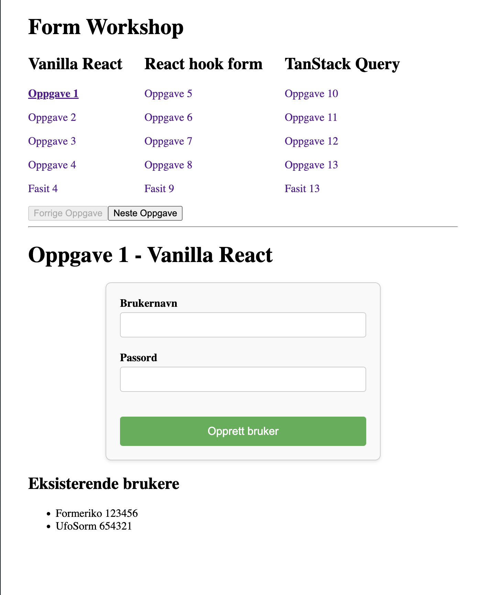

# React Form Workshop



Dette er en workshop for å lære skjemaer i React. Du finner oppgavene i `src/oppgaver`. Det er kun disse filene du trenger å endre.

Du leser oppgave1 i `Oppgave1.tsx`, og ser fasit i `Oppgave2.tsx` og så videre.

Unntaket er når det fins en egen fasit-fil, e.g. `Fasit4.tsx`. Da ser du fasiten, uten en ny oppgave.

Oppgavene starter med skjemaer i vanilla React, så det populære skjema-biblioteket [React Hook Form](https://react-hook-form.com/), så inkluderes også datahåndteringsbiblioteket [TanStack Query](https://tanstack.com/query/latest).

# Oppsett

For rett node-versjon, se `.nvmrc`.

Om du har [nvm](https://github.com/nvm-sh/nvm?tab=readme-ov-file#intro), kan du bruke følgende kommando:

```
nvm use
```

Installer avhengigheter:

```
npm install
```

I oppgavene trenger du ikke andre avhengigheter.

# Kjør applikasjon

Kjør klient (port 3000) og server (port 8000):

```
npm run dev
```

# Bidrag

Ser noen feil i workshopen? Gjerne si ifra til meg eller lag en PR.
